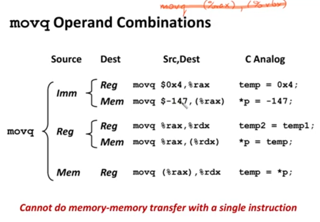
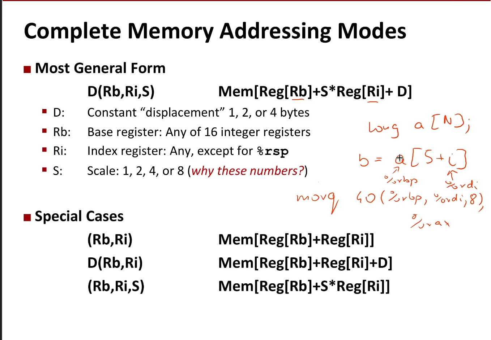
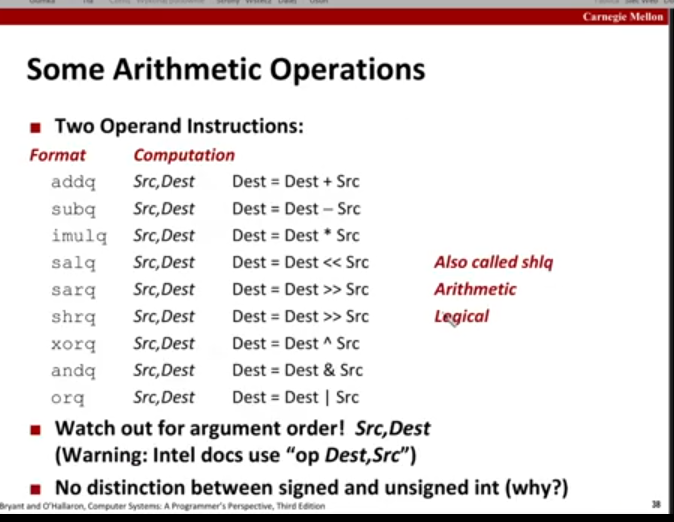
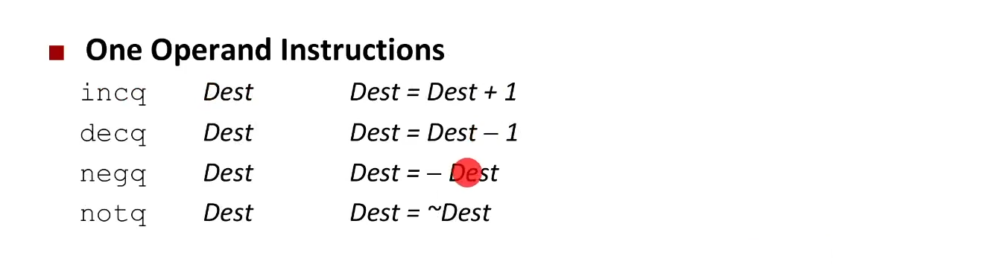

Notatka z MP 

# Wykład 4 -- Programowanie niskopoziomowe 

## Wstęp i historia
W zwykłych  programach używamy jedynie niewielkiej części instrukcji. Wystarczy nam poznać zestaw instrukcji procesorów CISC, aby móć ogarniać to co potrafią standardowe procesory x86, które mają ich więcej. Niektóre instrukcje są zaszłościami z roku 1978, taka historyczna skamielina. 

Dzisiajesze procesory tłumaczą znane ludziom komendy na pewne swoje wewnętrzene operacje. Częstotliowość taktowania już nie rośnie. Potrafimy jedynie dokładać kolejne rdzenie. Obecnie "najmniejszy" szczegół w fizycznej budowie procesorów procesorach ma 10nm, czyli około 100 atomów. Docieramy w tym temacjie powoli do granicy. 

Na tym kursie będziemy się uczyć jedynie pisać instruckcje dla procesorów `x86x64`.  

Obecnie największymi konkurentami na rynku procesorów są `Intel` i `AMD`. Po kolei wykupują też firmy związane z układami niskopoziomowymi i rynek ten w dziwny sposób przez to się konsoliduje. 

## Co się dzieje - schemat konwersji

``[Programista] -> [C++/C] -> [ISA zestaw instrukcji(generowany przez Assembler) ] -> [mikroarchitektura] -> [bramki logiczne i fizyka]``

Zestaw instrukcji w intelu i w AMD jest taki sam, ale na etapie mikroarchitektury już się różnią. Jako programiści nie sięgamy raczj niżej niż zetaw instrukji, na ASKu na pewno nie. Są jakieś inne przedmioty gdzie można się w to bawić ale nie tutaj.

## Określenia 

Architektura 

Mikroarchitektura - implementacja architektury 

Postacie kodu: 
Kod maszynowy -- bajty które rozumie komputer
Assebmler -- tekstowa reprezentacja kodu maszynowego 

## Wgląd do wykonywanych operacji 

``` 
Procesor :  PC, rejestry, Condition Codes
 -> Adres 
 <-> Dane 
 <- Instrukcje
 
Pamięć : Kod, dane, stos 
```

PC -- program counter(licznik instrukcji), trzyma adres następnej instrukcji 
Register file -- zmienne tymczasowe w procesorze, do których dostęp jest "za darmo", mała, mega szybka pamięć, mamy 16 rejestrów, możemy tam trzymać tymczasowe wyniki 

Condition Codes -- trzymamy informacje o ostatnich operacjach arytmetycznych, dzieki nim możemy wykonwyać skoki warunkowe 

## Assembler  
### Typy danych 
Typy danych: 1, 2, 4 lub 8 bajtów. Czyli wartości i adresy. 
Floating point data: 4 lub 8 bajtów. 
Jednostki wektorowe. 
Kod - sekwencja bajtów w pamięci. 
Nie mamy typów złożonych

### Rejestry 
Miejsca w pamięci gdzie możemy trzymać wartości tymczasowe. Mamy ich 16. Wszystkie rejestry są "prawie" takie same. Większość instrukcji można wykorzystać z większością rejestrów. 
Gdy mówisz `%rax` to bierzesz 8 bajtów, a `%eax` to bierzesz 4 bajty, chyba zrzutowane. Jest jeszcze `%ax` - najmłodsze 2 bajty. `%ah` i `%al` - starsza i młodsza połowa `%ax`. 

### Instrukcje  
Najważniejsze kategorie: 

+ Szereg operacji o dostępie do pamięci. 

+ Proste operacje które mogą działać na rejestrach lub pamięci(zwykle jeden z argumetnów musi być w rejestrze). Na przykłąd >>, +, | ^. 

+ Instrukcje warunkowe i skoki dokądś i skądś. 

Większość instrukcji: 

`[mnemonik][sufiks] [operandy źródłowy],[operand docelowy]` 

Sufiks mówi nam o typie danych.

My posługujemy się składnią AT&T 

Co może być w operandzie ? 

**Stała** -- `$0x400`, `$-533` -- zapisujemy je ze znakiem `$` na początku. Stała nie może mieć 8 bajtów(barokowość). 

**Rejestr** - jeden z 16 rejestrów: 
`%rax`, `%rcx` `%rdx` `%rbx`, `%rsi`, `%rdi`, `%rsp`, `%rbp`, `%rN`, gdzie N jest od 8 do 15. 
Jeden z rejestrów jest zarezerwowany na wskaźnik stosu. 

### Jak działa `movq` - przykład ? 



Możliwe źródła operacji: `` Imm(stała), Reg(rejestr), Mem(pamięć)`` 

*Nie można wykonać przepisania z pamięci do pamięci* 

### Dereferencja wskaźników 

**Normalna**: `(R) -- Mem[Reg[R]]` 

na przykład: `movq (%rcx), %rax `

**Z przesunięciem**: `D(R) -- Mem[Reg[R]+D]` 

Dereferencjonujemy miejsce wskazywane w `R` przesunięte o `D`. 

Na przykład `movq 8(%rbp), %rdx` -- wykona przepisanie wartości z komórki o 8 przesuniętej od miejsca zapisanego w `%rax` i wpisze to w `%rdx`. *To przesunięcie jest w bajtach? -- I dunno *

** Uwaga: ** Organizacja pamięci w komputerze jest w formacie Little Endian. 

### Comlete memory addressing modes 



### Instruckcja `leaq`
Składnia: `leaq Src, Dst` 

skrót od `load effective address`

Oblicza adres Src i ładuje do do Dst. Na przykład robi nam operację `p = &x[i]`. Ogólniej robi nam operację postaci `x + k*y`.  

Po co to? -- Instukcja leaq zajmuje jeden cykl, zamiast standardowego mnożenia które zajmuje 3 cykle. 


### Operacje arytmetyczne 




### trick z kompilacją 

`gcc -Og -S sum.c` powinno wygenerować assembler z pliku sum.c 


