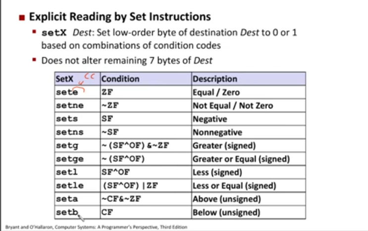
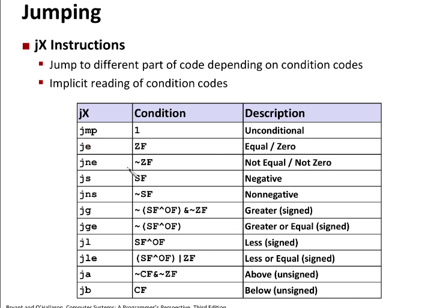
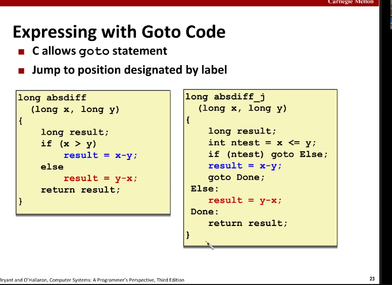

# Wykład 05 : Programowanie niskopozomiowe (cz.2) 

## Flagi 

**CF** -- Carry flag (for unsigned)   
**ZF** -- Zero flag  
**SF** -- Sign flag (for signed)  
**OF** -- Overflow flag (for signed)   

**addq** *Src,Dest* -- **t = a+b** 
**CF set** if carry/borrow from msb (unsigned overflow)  
**ZF set** if t == 0  
**SF set** if t < 0  
**OF set** if two's comlement (signed) overflow 
```c++ 
(a > 0 && b>0 && t<0) || (a<0 && b<0 && t>0) 
```

**Warning: leaq does not set these flags!**   

## Condition Codes (Comparare) 
**cmpq** *Src2,Src1* 
**cmpq b,a** like computing **t = a-b** without setting destination  

## Condition Codes (Test) 
**testq** *Src1,Src2* 
**testq b,a** like computing **t = b&a** without setting destination 

## Condition Codes (Set) 

**setX** *Dest*: Set lowest-order byte of destination *Dest* to $0$ or $1$ based on combination of condition codes  
X stands for some condition code name (based on last instruction)  


**Warning:** **movzbl %al, %eax** zeruje wszystkie pozostałe wszystko w **%rax** poza tym co wpiszemy 

## Jumping 
 
Odczyt zachodzi z ostatniej instrukcji która ustawia wartości flag 

## Conditional branch example (old style) 
`gcc -0g -S -fno-if-conversion control.c`    
flaga do kompilacji aby kompilator nam niczego nie psuł

```c++ 
long absd9ff(long x, long y) // rdi, rsi 
{ 
    long result; 
    if(x > y) 
        result = x-y; 
    else 
        result = y-x; 
    return restult; 
}  
```
```nasm
    absdiff: 
        cmpq %rsi, %rdi # x:y 
        jle .L4 
        movq %rdi, %rax 
        subq %rsi, %rax 
        ret 
    .L4: # x <= y 
        movq %rdi, %rax 
        subq %rdi, %rax 
        ret 
```
## Expression with Goto Code 
 

## Using Codnitional Moves 

**CMOVcc [cc, ne, le, g, a]**   

if(Test) Dest <- Src 

kompilator używa tego gdy: 
+ Obliczenie obywdu wyrażeń jest tanie
+ Obliczenia nie mają efektów ubocznych 
+ Obliczenia są bezbieczne (nie ma dereferencji dzieleń i takich magii) 

## Loops 


